# Moca AIR - Architecture Diagrams

## 🏗️ System Architecture Overview

```mermaid
graph TB
    subgraph "Frontend - React App"
        UI[Game UI Components]
        Hook[useAIRRewards Hook]
        Notif[AIR Rewards Notification]
    end
    
    subgraph "Services Layer"
        AIRService[MocaAIRService]
        SDK[@mocanetwork/airkit SDK]
    end
    
    subgraph "Backend API"
        GameAPI[/api/log-game-result]
        HistoryAPI[/api/game-history]
    end
    
    subgraph "Moca AIR Platform"
        Widget[AIR Widget]
        CredAPI[Credential API]
        IssuerAPI[Issuer API]
        VerifierAPI[Verifier API]
    end
    
    subgraph "Blockchain"
        MocaChain[Moca Chain Testnet]
        Logger[MocaGameLogger Contract]
    end
    
    UI --> Hook
    Hook --> AIRService
    AIRService --> SDK
    SDK --> Widget
    SDK --> CredAPI
    
    UI --> GameAPI
    GameAPI --> AIRService
    GameAPI --> Logger
    Logger --> MocaChain
    
    Widget --> IssuerAPI
    Widget --> VerifierAPI
    
    GameAPI --> Notif
    Notif --> UI
    
    style UI fill:#e1f5ff
    style AIRService fill:#fff3e0
    style SDK fill:#f3e5f5
    style MocaChain fill:#e8f5e9
    style Widget fill:#fce4ec
```

## 🎮 Game Flow with AIR Rewards


## 🎁 Reward Calculation Flow


## 🔐 Credential Issuance Flow


## 🔍 Credential Verification Flow

```mermaid
flowchart LR
    Start([Player Action]) --> Check{Has Credential?}
    
    Check -->|No| Redirect[Redirect to Issuer]
    Redirect --> Issue[Issue Credential]
    Issue --> Verify
    
    Check -->|Yes| Verify[Verify Credential]
    
    Verify --> VerifyAPI[Credential API]
    VerifyAPI --> Status{Status?}
    
    Status -->|Compliant| Success[✅ Access Granted]
    Status -->|NonCompliant| Fail[❌ Access Denied]
    Status -->|Pending| Wait[⏳ Wait for Confirmation]
    Status -->|Expired| Renew[⏰ Renew Required]
    Status -->|Revoked| Block[🚫 Blocked]
    
    Success --> End([Continue])
    Fail --> End
    Wait --> Retry[Retry Verification]
    Retry --> VerifyAPI
    Renew --> Issue
    Block --> End
    
    style Success fill:#c8e6c9
    style Fail fill:#ffcdd2
    style Wait fill:#fff9c4
    style Renew fill:#ffe0b2
    style Block fill:#f8bbd0
```



## 📊 Data Flow Architecture

```mermaid
graph LR
    subgraph "Client Side"
        Game[Game Component]
        Hook[useAIRRewards]
        Service[MocaAIRService]
    end
    
    subgraph "API Layer"
        LogAPI[/api/log-game-result]
        HistAPI[/api/game-history]
    end
    
    subgraph "Blockchain Layer"
        Logger[MocaGameLogger]
        Chain[Moca Chain]
    end
    
    subgraph "AIR Platform"
        Widget[AIR Widget]
        CredAPI[Credential API]
    end
    
    subgraph "Storage"
        LocalStorage[(Local Storage)]
        Blockchain[(Blockchain)]
    end
    
    Game -->|Game Result| LogAPI
    LogAPI -->|Track Activity| Service
    Service -->|Calculate| Hook
    Hook -->|Display| Game
    
    LogAPI -->|Log Game| Logger
    Logger -->|Write| Chain
    Chain -->|Store| Blockchain
    
    Service -->|Credentials| Widget
    Widget -->|Issue/Verify| CredAPI
    CredAPI -->|Record| Blockchain
    
    Hook -->|Cache| LocalStorage
    
    style Game fill:#e1f5ff
    style Service fill:#fff3e0
    style Logger fill:#e8f5e9
    style Widget fill:#fce4ec
    style Blockchain fill:#f3e5f5
```

## 🎯 Component Interaction

```mermaid
graph TB
    subgraph "Game Components"
        Roulette[Roulette]
        Plinko[Plinko]
        Mines[Mines]
        Wheel[Wheel]
    end
    
    subgraph "Shared Hooks"
        AIRHook[useAIRRewards]
        HistoryHook[useGameHistory]
    end
    
    subgraph "Services"
        AIRService[MocaAIRService]
        LoggerService[MocaGameLoggerService]
    end
    
    subgraph "UI Components"
        Notification[AIRRewardsNotification]
        Widget[MocaAIRTest]
    end
    
    subgraph "External"
        SDK[@mocanetwork/airkit]
        API[Moca AIR API]
    end
    
    Roulette --> AIRHook
    Plinko --> AIRHook
    Mines --> AIRHook
    Wheel --> AIRHook
    
    Roulette --> HistoryHook
    Plinko --> HistoryHook
    Mines --> HistoryHook
    Wheel --> HistoryHook
    
    AIRHook --> AIRService
    HistoryHook --> LoggerService
    
    AIRService --> SDK
    SDK --> API
    
    AIRHook --> Notification
    AIRService --> Widget
    
    style Roulette fill:#ffebee
    style Plinko fill:#e3f2fd
    style Mines fill:#f3e5f5
    style Wheel fill:#e8f5e9
    style AIRHook fill:#fff3e0
    style AIRService fill:#fce4ec
```

## 🔄 State Management Flow


## 🌐 Environment Configuration


## 📱 User Journey


## 🔧 Error Handling Flow

```mermaid
flowchart TD
    Start([API Call]) --> Try{Try Operation}
    
    Try -->|Success| Success[Return Success]
    Try -->|Error| ErrorType{Error Type?}
    
    ErrorType -->|Network| NetworkError[Network Error]
    ErrorType -->|Auth| AuthError[Authentication Error]
    ErrorType -->|Validation| ValidationError[Validation Error]
    ErrorType -->|Unknown| UnknownError[Unknown Error]
    
    NetworkError --> Retry{Retry?}
    Retry -->|Yes| Wait[Wait & Retry]
    Wait --> Try
    Retry -->|No| LogError
    
    AuthError --> RefreshToken{Refresh Token?}
    RefreshToken -->|Yes| GetNewToken[Get New Token]
    GetNewToken --> Try
    RefreshToken -->|No| LogError
    
    ValidationError --> LogError[Log Error]
    UnknownError --> LogError
    
    LogError --> Fallback[Use Fallback]
    Fallback --> GracefulDegradation[Graceful Degradation]
    
    Success --> End([Continue])
    GracefulDegradation --> End
    
    style Success fill:#c8e6c9
    style LogError fill:#ffcdd2
    style GracefulDegradation fill:#fff9c4
    
    note right of GracefulDegradation
        - Show cached data
        - Disable AIR features
        - Continue game play
        - Notify user
    end note
```

## 📈 Reward Progression System


## 🎮 Game Type Multipliers


## 📊 Reward Distribution


---

## 📝 Diagram Legend

- **Blue boxes**: Frontend components
- **Orange boxes**: Services and APIs
- **Purple boxes**: SDK and external services
- **Green boxes**: Blockchain and storage
- **Pink boxes**: AIR Platform components
- **Yellow boxes**: Data and outputs

## 🔗 Related Documentation

- [MOCA_AIR_INTEGRATION.md](./MOCA_AIR_INTEGRATION.md) - Integration guide
- [GAME_AIR_INTEGRATION_EXAMPLE.md](./GAME_AIR_INTEGRATION_EXAMPLE.md) - Game integration examples
- [Moca Network Documentation](https://docs.moca.network/)
- [AIR Credential Example](https://github.com/MocaNetwork/air-credential-example)
